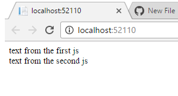

# WebPackNetcore

Webpack is the module bundler, AMD and requirejs is its competitor. Webpack becomes more and more popular due to its eay to use. I try to implement this simply techniques in asp.net core.

###The procedures are:
<pre>
1,create a new asp.net core web application
2, open project folder in window explorer, run cmd to install webpack globally npm install -g webpack
3, npm install -g requirejs
4, open js folder in wwwroot, add js1.js, js2.js, style.css, and one.js four files (need css-loader, style-loader)
5, point cmd to js folder ro run webpack command webpack ./one.js site.js
6, put site.js in html page as < script src=" ./js/site.js">< /script>
7, run index.cshtml to check the result as below

8, here, webpack merge js together into site.js and attach css file to html page at runtime.
9, no matter how many js file, we can use webpack to consolidate them into on js file for html page. this is siimple and easy to implement.
</pre>
Webpack better is running in cmd format, this enables us to simplify visual studio tasks.

###Requirejs in asp.net MVC project

 asp.net MVC project @script section can be used to assign different javascripts to differnet pages when we add @script section in _layout.cshtml. Each child pages then will insert @section Scripts {} into html to call javascript.
 
 We may download a lt of js files into projects for some templates. we simply add all js file via < script > tags. so one page may contains over 20 js files, this will slow down the page loading. How about we just call js files we need in the page? We use requirejs. this can execute the js in run time and clean up the memory for next page action. the page loading performance can be improved. 
 
Require js can be used in each page to load the js file as code below

<pre>

 < script src="~/Scripts/require.js">< /script>
    @RenderSection("scripts", required: false)
 < /body>
 
 
@section Scripts {
    < script type="text/javascript">
        require(["../Scripts/main"],function () {
            require(["currentDateTime", "customer"],
            function (currentDateTime, customer) {
                currentDateTime; 
                customer;
            }
            );
        });
        < /script>
        }
        
</pre>

customer.js file is the one we develop for the whole application. we simply call this in each apge via requirejs way.

this is all. of course, we need do some confiuration first. 

This technique can greatly improve the js file load in page to speed the page loading.

 
